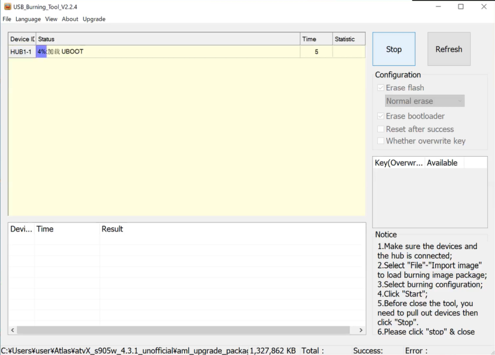

# X96 Mini S905W / MXQ S905W Configuration
This is for X96 Mini / MXQ S905W Chip Configuration. ROM flashed in this instruction is Android 9, 32bit mode and wifi available.  
## Requirements
- Windows PC
- USB BURNING TOOL ([Amlogic_USB_Burning_Tool_v2.2.4](https://androidmtk.com/download-amlogic-usb-burning-tool))
- ROM to flash. I use from [atvXperience #884](https://forum.atvxperience.com/viewtopic.php?p=19913#p19913), [NON-SUPPORTED ROM](https://mega.nz/file/025z0KCY#D1b6S_kJn2H6fKvQbQr_epjlRJfnU0euu_0mqQemMAU) which has Magisk Root capability.
- Mouse and Keyboad
- USB-A to USB-A cable
- Magisk 25.2. [Magisk-v25.2.apk](https://github.com/topjohnwu/Magisk/releases/tag/v25.2)
- Magisk safetynet fix module. (I use [safetynet-fix-v2.4.0.zip](https://github.com/kdrag0n/safetynet-fix/releases/tag/v2.4.0))
- Optional. YASNAC (short for Yet Another SafetyNet Attestation Checker). (I use [yasnac-v1.1.5.r65.15110ef310-release.apk](https://github.com/RikkaW/YASNAC/releases/tag/v1.1.5))
---
### Steps
1. Flash rom using USB BURNING TOOL (Amlogic_USB_Burning_Tool_v2.2.4)
   - X96 mini : **`Most left`** USB port (white USB port)
   - MXQ : **`Most right`** USB port
   1. Import ROM image downloaded.
   2. Click Start before connecting USB between PC to Device
   3. I recommand everything (Keyboard, mouse and power cable) is disconnected from device before start. Push button inside `AV` hole(One type of MXQ has `R` hole between USB). You need very small screw driver to push the button inside hole. While pushing the button, connect USB to device. Then burning tool detects the device and starts flashing. You can remove screw driver once flashing started and progress bar is like 4%.
   4. Once successfully flashed. Push stop button and now you can disconnect USB.

<p align="center"></p>

2. Connect Keyboard, Mouse and Display then plugin power cable.
3. Connect wifi or ethernet and remember IP address.
4. Install Magisk 25.2 by
   ```
   adb connect 192.168.1.201
   ```
   ```
   adb -s 192.168.1.201 install Magisk-v25.2.apk
   ```
5. adb into the ATV and
    ```
    adb -s 192.168.1.201 shell
    ```
    then
    ```
    su
    ```
    When you type su, grant superuser will pop up on ATV display and need to push grant.
6. Pull boot image
   ```
   dd if=/dev/block/boot of=/sdcard/boot.img
   ```
7. Open Magisk app. Grant superuser if permission pup up when open Magisk app.
8. Press the Install button in the Magisk App.
9. Choose "Select and Patch a File" in method, and select the boot.img in /sdcard/ directory.
10. Press Let's go, then you will see
   ```
   - Device platform: armeabi-v7a
   - Installing: 25.2 (25200)
   - Copying image to cache
   - Unpacking boot image
   - Checking ramdisk status
   - Stock boot image detected
   - Patching ramdisk
   - Repacking boot image

   ****************************
   Output file is written to
   /storage/emulated/0/Download/magisk_patched-25200_xxxxx.img
   ****************************
   - All done!
   ```
11. Go to Linux terminal. Copy patched image magisk_patched-25200_xxxxx.img in /sdcard/Download/
    ```
    adb -s 192.168.1.201 pull /sdcard/Download/magisk_patched-25200_xxxxx.img
    ```
    you can use this patched img for device with same model and no need to patch again
12. Push patched.img to /sdcard/
    ```
    adb -s 192.168.86.201 push magisk_patched-25200_xxxxx.img /sdcard/
    ```
13. adb into the device
    ```
    adb -s 192.168.1.201 shell
    ```
    ```
    dd if=/sdcard/magisk_patched-25200_xxxxx.img of=/dev/block/boot
    ```
14. Reboot
15. Open Magisk app. Then you should get `Abnormal state` warning. If you don't get abnormal warning, try 13 again and reboot and open Magisk app again to make sure you get `Abnormal state` warning. If still you don't get the warning even retry 6-13.
16.  If you get warning. adb into the device remove `/system/xbin/su`
   ```
   adb -s 192.168.1.201 shell
   su
   mount -o rw,remount /
   rm /system/xbin/su
   reboot
   ```
17. Open Magisk app and now you should not get abnormal state warning.
18. Open Magisk App. Go to settings (Gear Icon). Enable Zygisk and Configure DenyList to add Google Play Service (Need to Show system apps by clicking top right `...` )
19. reboot
20. Install magisk safetynet-fix module
```
user@linuxpc:~/Atlas$ adb connect 192.168.1.201
connected to 192.168.1.201:5555
user@linuxpc:~/Atlas$ adb -s 192.168.1.201 push safetynet-fix-v2.4.0.zip /data/local/tmp
safetynet-fix-v2.3.1.zip: 1 file pushed. 0.2 MB/s (95201 bytes in 0.586s)
user@linuxpc:~/Atlas$ adb -s 192.168.1.201 shell
atvX:/ $ su
atvX:/ # cd /data/local/tmp/
atvX:/data/local/tmp # magisk --install-module safetynet-fix-v2.4.0.zip
- Device is system-as-root
*************************
 Universal SafetyNet Fix
 by kdrag0n
*************************
*******************
 Powered by Magisk
*******************
- Extracting module files
- Done
atvX:/data/local/tmp #
```
21. Install pokemongo, Atlas, yasnac(optional) app and push atlas_config.json.
```
user@linuxpc:~/Atlas$ adb -s 192.168.1.201 install pokemongo_0.283.1.apk
Success
user@linuxpc:~/Atlas$ adb -s 192.168.1.201 install PokemodAtlas-Public-v22071801.apk
Success
user@linuxpc:~/Atlas$ adb -s 192.168.1.201 install yasnac-v1.1.5.r65.15110ef310-release.apk
Success
user@linuxpc:~/Atlas$ nano atlas_config.json
user@linuxpc:~/Atlas$ adb -s 192.168.1.201 push atlas_config.json /data/local/tmp
atlas_config.json: 1 file pushed. 0.0 MB/s (182 bytes in 0.014s)
user@linuxpc:~/Atlas$
```
22. Configure Denylist and add pokemongo and yasnac and Atlas(optional).
23. reboot
24. Open yasnac and check if safetynet pass or not. It should show `Basic`/`CTS profile match` both Pass.
25. Start Atlas and check name/endpoint and start.

Done!

## Warnings
> If you want to re-flash after installing this rom, then be aware that the usb burn tool might not recognize the device automatically. You need to do adb reboot update in order to flash.</br>

by plinytheelder

## References/Credits
- [Working ATVs for Atlas](https://github.com/madBeavis/PimpMyAtv/wiki/Working-ATVs-for-Atlas) by madBeavis
- [X96 Max Plus 5](https://docs.google.com/document/d/1SdaiJKAs2fJVMGLSI-TdORvwDh_THPAP8nqQbtEluno/edit#heading=h.oelb25v5f8ex) by BoomEX
- [MXQ S905W](https://docs.google.com/document/d/1PusB45JXq6WyolvezFZgAtQLZN_fPcvJ2FvAbAGihh0/edit) by geekygreek7
- Many useful comments by plinytheelder in Atlas Discord
